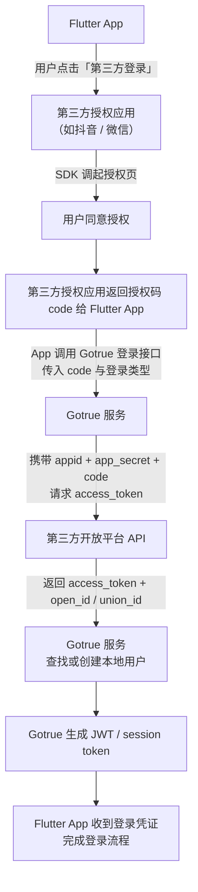

# 登录对接

## 登录流程
微信和抖音都用的是 OAuth2.0 规范进行授权的，所以流程上基本一致，只是细节命名上稍有不同。

### 流程图

> 流程图需要安装 mermaid 插件

## 实现设计

gotrue是针对，网页进行授权的OAuth流程，并不适用我们的场景： 通过app集成的sdk获取code直接请求服务器进行账号处理，签发jwt，一个接口完成的业务流程。
所以,是新写的一套实现。微信/抖音都是基于 OAuth2.0 ，所以可以在一定程度上进行复用。

## 请求流程详解

抖音获取code与sdk对接参考：
https://developer.open-douyin.com/docs/resource/zh-CN/dop/develop/sdk/mobile-app/permission/get-permission-token

微信参考：
https://developers.weixin.qq.com/doc/oplatform/Mobile_App/WeChat_Login/Development_Guide.html

gotrue端请求登录接口参考 `/http/third_party_login.http` 文件

## token 生命周期与刷新机制

### 抖音

刷新用户授权的 access_token 或续期：  
当 access_token 过期（过期时间 15 天）后，可以通过刷新 access_token 接口的 refresh_token（过期时间 30 天）参数进行刷新，刷新 access_token 或续期不会改变 refresh_token 的有效期。
状态说明：
- 若 access_token 已过期，调用接口会报错（error_code=10008或 2190008），refresh_token 后会获取一个新的 access_token 以及新的超时时间。
- 若 access_token 未过期，refresh_token 不会改变原来的 access_token，但超时时间会更新，相当于续期。
- 若 refresh_token 过期，获取 access_token 会报错（error_code=10010），此时需要重新走用户授权流程。

**凭证有效期表**

| 凭证            | 说明                        | 有效期   |
|---------------|---------------------------|-------|
| code          | 临时调用凭证，用于获取 access_token。 | 10 分钟 |
| access_token  | 接口调用凭证，用于需要用户授权才可以调用的接口。  | 15 天  |
| client_token  | 接口调用凭证，用于不需要用户授权就可以调用的接口。 | 2 小时  |
| refresh_token | 刷新令牌，用于刷新 access_token。   | 30 天  |

### 微信
access_token 是调用授权关系接口的调用凭证，由于 access_token 有效期（目前为 2 个小时）较短，当 access_token 超时后，可以使用 refresh_token 进行刷新，access_token 刷新结果有两种：

1. 若access_token已超时，那么进行refresh_token会获取一个新的access_token，新的超时时间；
2. 若access_token未超时，那么进行refresh_token不会改变access_token，但超时时间会刷新，相当于续期access_token。
   refresh_token 拥有较长的有效期（30 天），当 refresh_token 失效的后，需要用户重新授权。